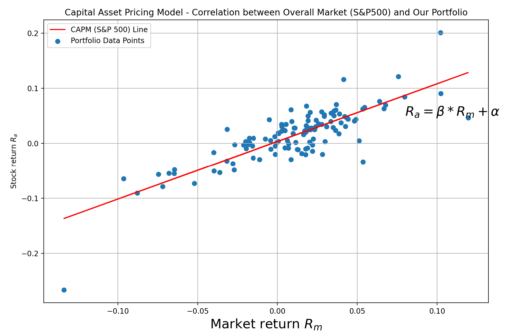
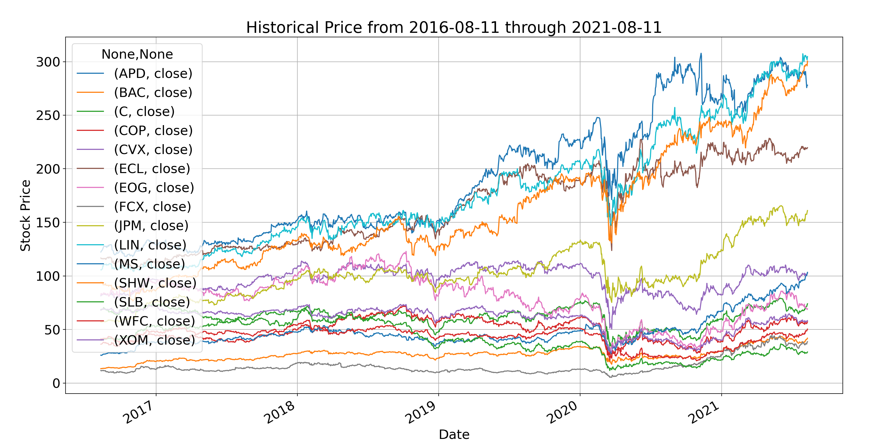
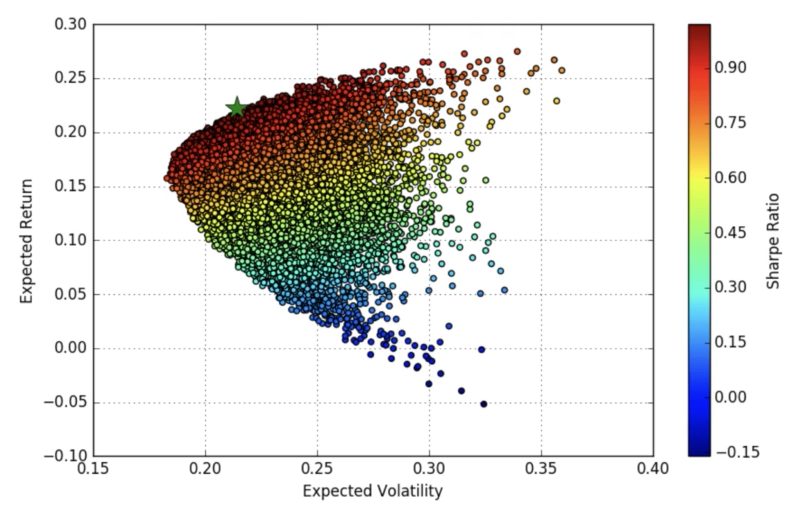
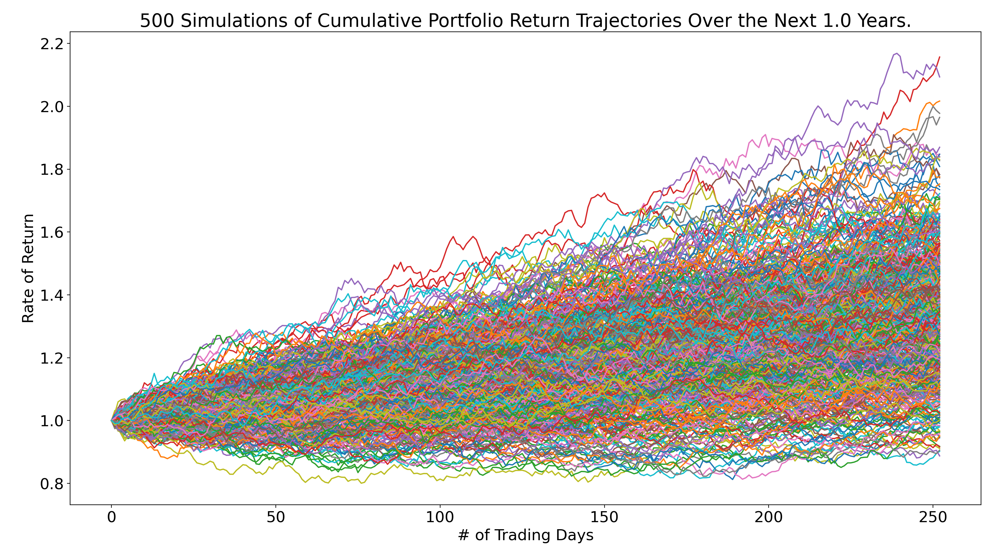
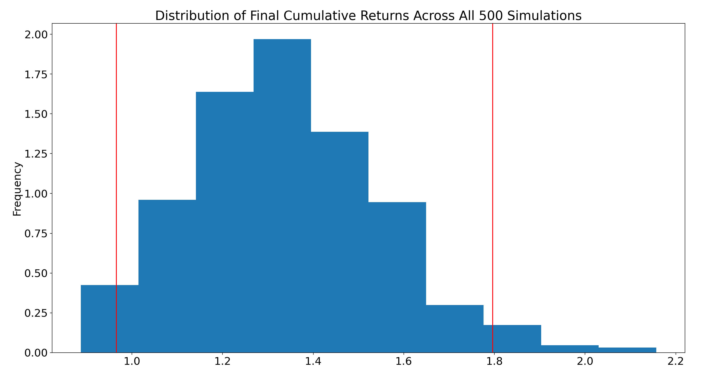

# **Portfolio Builder**

Our goal is to assist the user to choose the three market sectors of the S&P 500 and create a portfolio of stocks based on the sectors chosen. To provide the user with the best experience, our stock picker will pick the top five stocks by marketcap in each of the three sectors chosen to create the optimal portfolio.


---

## **Overview of the S&P 500 Sectors**

The S&P sectors, or Global Industry Classification Standard (GICS), organizes companies based on their primary business activities. The order of the sectors below are based on size:

1. **Information Technology**

    The information technology – IT – sector consists of companies that develop or distribute technological items or services, and includes internet companies. Technology products include computers, microprocessors, and operating systems. Example of companies in this sector includes big names like Microsoft Corporation, Oracle Corp., and Mastercard Inc. This sector has seen a lot of change in recent years because of the rapid rise in technology-based companies.

2. **Health Care**

    Health care consists of medical supply companies, pharmaceutical companies, and scientific-based operations or services that aim to improve the human body or mind. Familiar names include Johnson & Johnson, a medical device and pharmaceutical company that owns Tylenol, and Abiomed, which manufactures medical implant devices.

    Cannabis companies are a new, but rapidly growing, part of the health care sector. Currently, the more well-known ones include Canopy Growth Corp. and Aurora Cannabis, with market caps of $23 billion and $12 billion, respectively.

3. **Financials**

    The financial sector includes all companies involved in finance, investing, and the movement or storage of money. It includes banks, credit card issuers, credit unions, insurance companies, and mortgage real estate investment trusts (REITs). Companies within this sector are usually relatively stable, as many are mature, well-established firms. Banks in this sector include Bank of America Corp, JPMorgan Chase & Co., and Goldman Sachs. Other notable sector names include Berkshire Hathaway, American Express, and Aon plc.

4. **Consumer Discretionary**

    Discretionary consumer products are luxury items or services that are not necessary for survival. The demand for these items depends on economic conditions and the wealth of individuals. Products include cars, jewelry, sporting goods, and electronic devices. Luxury experiences include trips, stays at hotels, or dining in a posh restaurant. Most companies in this sector are easily recognized. Some examples include Starbucks, Best Buy, and Amazon.

5. **Communication Services**

    The communication services sector consists of companies that keep people connected. This includes internet providers and phone plan providers. The more exciting part of the sector includes media, entertainment, and interactive media & services companies. Netflix Inc. and Walt Disney Co. are considered part of the communication services sector. Other companies within this sector include AT&T, CBS Corp., and Facebook.

6. **Industrials**

    Industrials include a wide range of companies, from airlines and railroad companies to military weapons manufacturers. Since the range of companies is so large, the sector has 14 different industries. Two of the largest industries are Aerospace & Defense and Construction & Engineering. The best known names within this sector are Delta Air Lines and Southwest Airlines, FedEx Corporation, and Boeing Company.

7. **Consumer Staples**

    Consumer staples companies provide all the necessities of life. This includes food and beverage companies, household product providers, and personal product providers. Consumer staple companies are well known, since people see their products in stores regularly. For example, Procter & Gamble is a famous company within this sector, which produces bleach and laundry detergent under brand names such as Dawn and Tide. Another example is Kroger, which is the largest supermarket chain in the U.S.

8. **Energy**

    The energy sector consists of all companies that play a part in the oil, gas, and consumable fuels business. This includes companies that find, drill, and extract the commodity. It also includes the companies that refine the material and companies that provide or manufacturer the equipment used in the refinement process. Companies such as Exxon Mobil and Chevron extract and refine gas, while companies like Kinder Morgan transport fuel to gas stations.

9. **Utilities**

    Utility companies provide or generate electricity, water, and gas to buildings and households. For example, Duke Energy generates and distributes electricity, and Southern Company provides gas and electricity. Many utility companies are developing more renewable energy sources.

10. **Real Estate**

    As the name suggests, the newest addition to the S&P sectors includes Real Estate Investment Trusts (REITs), as well as realtors and other companies. The real estate sector makes up 2.9% of the S&P 500. Companies in the sector include American Tower Corp., Boston Properties, and Equinix.

11. **Materials**

    Companies within the materials sector provide the raw material needed for other sectors to function. This includes the mining companies that provide gold, zinc, and copper, and forestry companies that provide wood. Companies that are not typically associated with materials but are in the sector include container and packaging companies such as the Intertape Polymer Group, a company that produces tape.

---

## Capital Asset Pricing Model (CAPM)




---

## **Historical Prices: 5 Year Data Price Trend**

The Historical Price Plot shows the last five years of stock prices of all 15 chosen stocks based on the sectors the user has chosen.

**Here is an example of what the plot looks like:**



---

## **Efficient Frontier: Markowitz Model**
    
Markowitz model was introduced in 1952 by Harry Markowitz. It’s also known as the mean-variance model and it is a portfolio optimization model – it aims to create the most return-to-risk efficient portfolio by analyzing various portfolio combinations based on expected returns (mean) and standard deviations (variance) of the assets.

The original assumptions made by Markowtiz were as follows:

1. The risk of the portfolio is based on its volatility (and covariance) of returns.

2. Analysis is based on a single-period model of investment.

3. An investor is rational, adverse to risk, and prefers to increase consumption. 

4. An investor either minimizes their risk for a given return or maximizes their portfolio return for a given level of risk.



The **Efficient Frontier** is a hyperbola representing portfolios with all different combinations of assets that result into efficient portfolios, meaning **with the lowest risk, given the same return and portfolios with the highest return given the same risk**. 

---

## **Monte Carlo Simulation**

The Monte Carlo program will run a one year projected simulation of the chosen stocks based on their weights calculated as the optimal portfolio in the Markowtiz Model. The output of the Monte Carlo will show the user, within the 95% confidence interval, the likely return range. **For example, the user will see the following:**

        There is a 95% chance that an initial investment of $1000 in the portfolio over the next 1 year will end within a range of $(Lowest potential return) and $(Highest potential return). 

**Here is an example of what the Monte Carlo Simulation will look like:**



**Here is an example, based on the Monte Carlo Simulation, the distribution of all the final cumulative returns would look like across the 500 recorded simulations:**



---

## **Technologies**

The following will need to be installed in order to run the program:

```python
import numpy as np
import questionary
from sqlalchemy import log
import yfinance as yf
import pandas as pd
import matplotlib.pyplot as plt
import scipy.optimize as optimization
import datetime as dt
from datetime import date
import pandas as pd
import matplotlib.pyplot as plt
import scipy.optimize as optimization
import datetime as dt
from datetime import date
from workflow.MCForecastTools import MCSimulation
```

---

## **What the Program actually does...**

1. Get data from Wikipedia/Yahoo Finance! to create our master list and market cap of each.

2. Put all data into CSV file and into a SQL, since it is easier to sort/slice by sector and organize by market cap.

3. Send the sliced data to `yfinance` to get the 1 year annualized return.

4. print 1 year return by sector to data frame and send the sectors to the list of questions.

5. Ask's the user to select 3 sectors and input investment amount.

6. Send the stocsk from teh selected sectors to `yfinance` to pull 10 years of data.

7. Pass the data to the Markowitz Model to generate the weights, return, volatility, and sharpe ratios.

8. Pass the weights into the Monte Carlo simulation.

9. Run the Monte Carlo simulation to get the simulated range of returns. 

---

## **Contributors**

This program is brought to you by Scott Slusher and Billy Bishop

---

## **License**

Copyright (c) 2021 `scottslusher` & `billybishop21`

Permission is hereby granted, free of charge, to any person obtaining a copy of this software and associated documentation files (the "Software"), to deal in the Software without restriction, including without limitation the rights to use, copy, modify, merge, publish, distribute, sublicense, and/or sell copies of the Software, and to permit persons to whom the Software is furnished to do so, subject to the following conditions:

The above copyright notice and this permission notice shall be included in all copies or substantial portions of the Software.

THE SOFTWARE IS PROVIDED "AS IS", WITHOUT WARRANTY OF ANY KIND, EXPRESS OR IMPLIED, INCLUDING BUT NOT LIMITED TO THE WARRANTIES OF MERCHANTABILITY, FITNESS FOR A PARTICULAR PURPOSE AND NONINFRINGEMENT. IN NO EVENT SHALL THE AUTHORS OR COPYRIGHT HOLDERS BE LIABLE FOR ANY CLAIM, DAMAGES OR OTHER LIABILITY, WHETHER IN AN ACTION OF CONTRACT, TORT OR OTHERWISE, ARISING FROM, OUT OF OR IN CONNECTION WITH THE SOFTWARE OR THE USE OR OTHER DEALINGS IN THE SOFTWARE.

---


